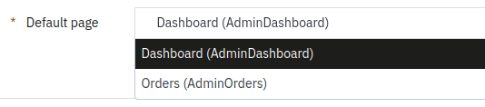

# Prestashop Admin Homepage

[](https://php.net/)
[](https://www.prestashop.com)
[](https://github.com/Pixel-Open/prestashop-admin-home/releases)

## Presentation

With Prestashop 8, admin users can no longer be redirected to the classic dashboard page after login. An advertising wall called "Home" has replaced it.

This module allows you to choose either the classic dashboard or any page as the admin homepage in the account profile.



## Requirements

- Prestashop >= 8.0.0
- PHP >= 7.4.0

## Installation

Download the **pixel_admin_home.zip** file from the [last release](https://github.com/Pixel-Open/prestashop-admin-home/releases/latest) assets.

### Admin

Go to the admin module catalog section and click **Upload a module**. Select the downloaded zip file.

### Manually

Move the downloaded file in the Prestashop **modules** directory and unzip the archive. Go to the admin module manager section and search for "Admin Home".

## Allowed pages

By default, the user will only be able to choose the classic dashboard page.

You can customize the list of allowed pages via the `pixel_admin_home.txt` file in the module's root directory.

Add the class names of the pages you want to make available. One class per line. For example:

```text
AdminDashboard
AdminOrders
AdminProducts
```

The list of available class names can be obtained with the following query:

```sql
SELECT class_name, wording FROM ps_tab WHERE position > 0;
```

**Note:** the table prefix (`ps_`) should be adjusted according to your project.